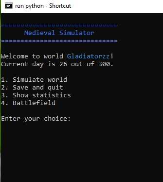
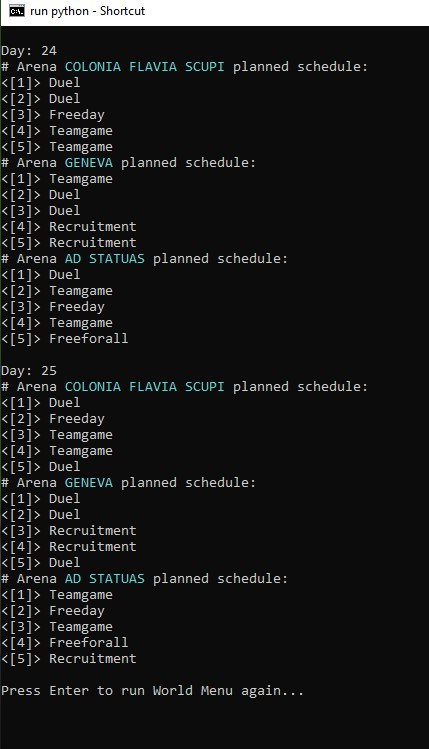
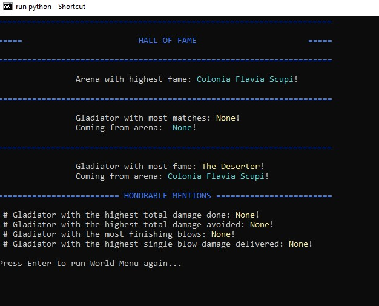
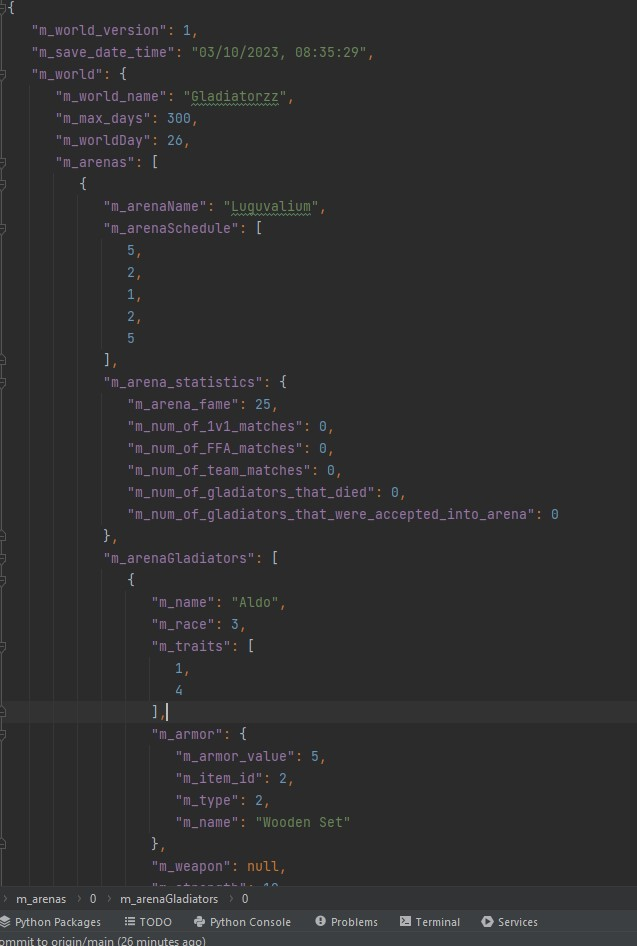
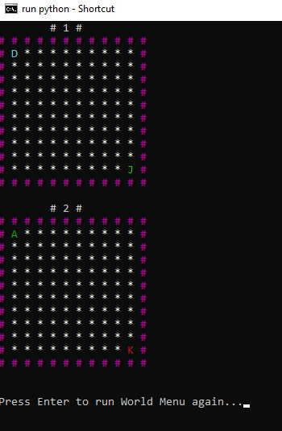
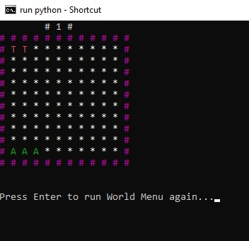
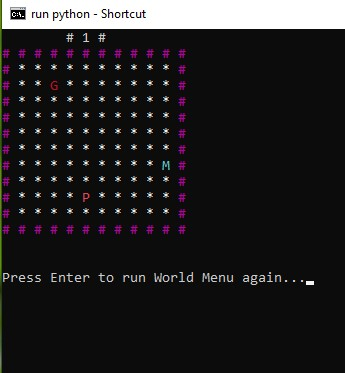

# Name
 ~ description, what am I doing here?
 
 Features:
 - Serialization system. Scalable serialization interface implementation that uses waterfall-like saving and loading of serializable objects into and from JSON.
 - Simple console GUI. Used for data visualization and simulation control.
 - Wide array of object's permutation. Gladiator classes with different races, traits, attributes that controls each Gladiator's ability to perform in combat.
 - World variability. Almost every significant object has it's own name generator to ensure no two worlds are the same.
 - Item system. weapons and armors. Uses simple JSON database to load data into the game. Items are accessible for gladiators to use.
 - Statistics system. Each participant in our simulator is gathering data for evaluation later on.
 - Configuration system. All important variables that controls the game on systematic level are read from configuration .ini file, where they are easily accessed for further changes in game design.

 ## World Menu

 ## In simulation, you can choose how many days

 ## Statistics will print you out the best of the best (not finished yet)

 ## Upon saving, all data from simulations are serialized into JSON file, from which you can load your world next time

 ## In battlefield you can choose which battlemod to use, which will handle the print of fields, filled with gladiators and their starting positions
 # Duel (oposing corners)

 # Team vs Team (base line, with up to 10 v 10 teams)

 # Free for all (random positions)

 
 TODO:
 - 2D battlefield implementation, arena event system
 - Combat simulator, pathfinding algorithms, combat speed and time axis
 - Data visualization
 - Abilities, status effects, combat depth
 - World economy
 - Shopkeeper, merchant and gladiator autonomy with gaining advanced weapons and armors
 - Global competition, racial performance
 - 2D Graphics!
 - ...
